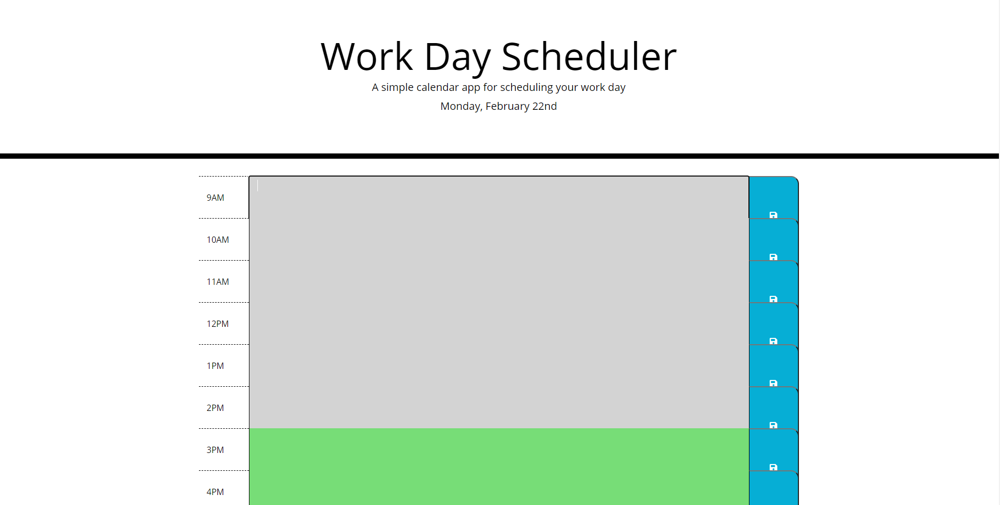
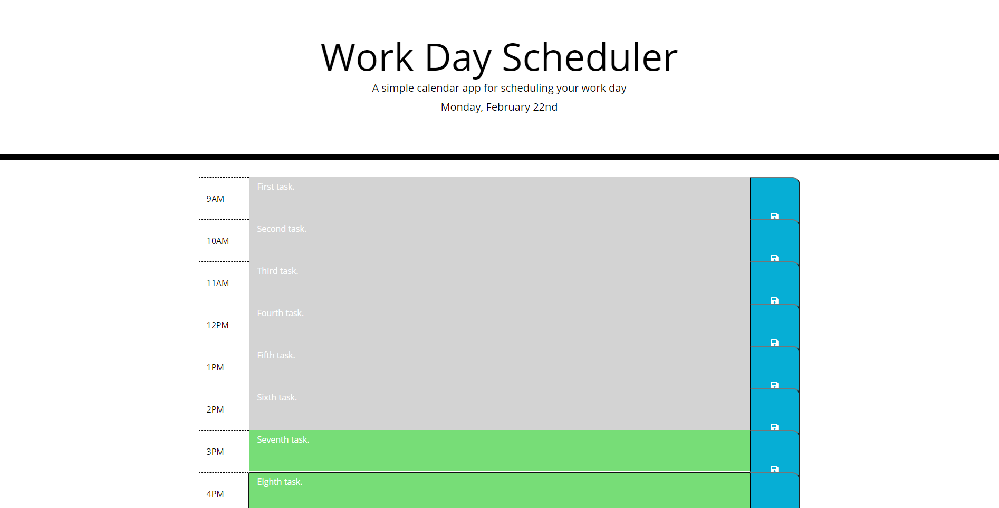

# work-day-scheduler

## Description

Work Day Scheduler is an application for a user to enter tasks to be completed throughout the day. The color of the rows changes depending on the time of the day to reflect the time for that task has passed.

Below is a screenshot of the landing page for the application:

And here is a screenshot of the page after adding some tasks:

## Table of Contents

* [Installation](#installation)
* [Usage](#usage)
* [License](#license)
* [Contributing](#contributing)
* [Tests](#tests)
* [Questions](#questions)

## Installation

There is no need to install anything to interact with the application. Simply navigate to the deployed application by clicking on the link below.

https://chavalk.github.io/work-day-scheduler/

## Usage

The application is built allow users to enter tasks to complete throughout the day.

## Contributing

No contributions are currently accepted for this project.

## Tests

There is no testing available within the application.

## Questions

My GitHub username is: chavalk

Link: https://github.com/chavalk

If you have additional questions, feel free to reach me at chavalk@hotmail.com.